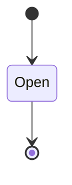
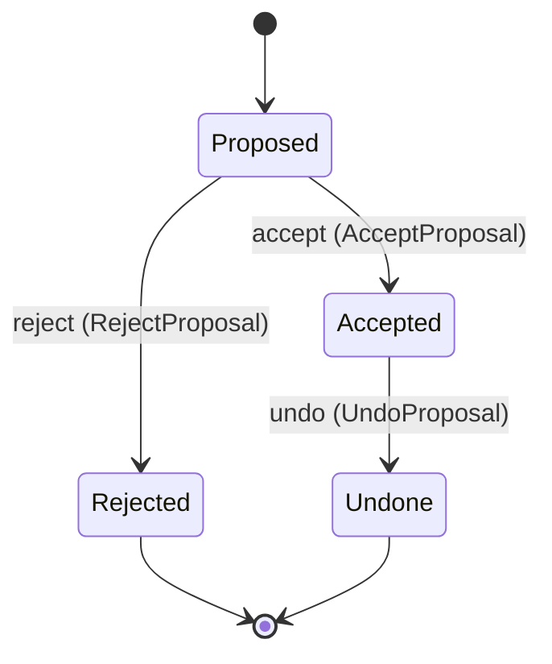

<!--
generated from uilab v1
model digest 671836a8392f9ff5e57e7fc2b988468dc076692b9031754b5c33c0622ff876cf
contract digest slice-sha256/2:efb7b0f3ed15c411619f395acaebf4f25c8688f35200d2b779dc1dfd35b1ebcd
do not edit: regenerate with `ess generate`
-->

# Session

One open UI document, the node the operator has selected in it, and the patches an agent proposes there. A patch changes the document only when the operator accepts it.

`uilab.session` is one of uilab's bounded contexts. [Back to the index](../index.md).

## Types

### `DocumentId`

`uilab.session.DocumentId` wraps `Uuid` and is not interchangeable with one: the whole value of naming it separately is the crossings the model then refuses.

### `NodePath`

`uilab.session.NodePath` wraps `String` and is not interchangeable with one: the whole value of naming it separately is the crossings the model then refuses.

### `PatchBody`

`uilab.session.PatchBody` wraps `Json` and is not interchangeable with one: the whole value of naming it separately is the crossings the model then refuses.

### `PatchOp`

`uilab.session.PatchOp` is one of `Insert`, `Replace`, `Remove` and `Batch`.

### `ProposalId`

`uilab.session.ProposalId` wraps `Uuid` and is not interchangeable with one: the whole value of naming it separately is the crossings the model then refuses.

## Entities

An entity is what this context is about: something with an identity that outlives any one request, a shape, and a lifecycle. The lifecycle is exhaustive — a move that is not drawn below is a move this specification does not permit, and that is the only way it says so. Every move is labelled with the command that takes it, because a move nothing can trigger is refused rather than drawn.

### `Document`

`uilab.session.Document`.

An instance is identified by `document_id`, a `uilab.session.DocumentId`. The name is part of the model and not a convention: a view projects the identity under that name, so a projection inventing its own would disagree with the view.

It holds:

- `path` — `String`
- `selected` — `uilab.session.NodePath`

It owns any number of [`Proposal`](#proposal), as `proposals`, carried by `Proposal.document_id`.

No invariant is declared, so nothing here constrains an instance at rest.

Its state is a `uilab.session.Document.State`, one of `Open`. That enum is synthesised from the lifecycle rather than declared beside it, so the states a view's filter compares and the states drawn below cannot disagree.

An instance is created in `Open`. `Open` is terminal, so an instance may rest there forever. That is declared rather than inferred from having no way out: an entity that cannot leave a state is either finished or stuck, and only its author knows which.

It declares no moves, so nothing changes its state once it exists.

It has one state, so there is no move to permit or to forbid.

One view projects it: [`Documents`](#documents).

### `Proposal`

`uilab.session.Proposal`.

An instance is identified by `proposal_id`, a `uilab.session.ProposalId`. The name is part of the model and not a convention: a view projects the identity under that name, so a projection inventing its own would disagree with the view.

It holds:

- `document_id` — `uilab.session.DocumentId`
- `target` — `uilab.session.NodePath`
- `op` — `uilab.session.PatchOp`
- `utterance` — `String`

Its `document_id` is what [`Document`](#document) owns it by, as `proposals`.

No invariant is declared, so nothing here constrains an instance at rest.

Its state is a `uilab.session.Proposal.State`, one of `Accepted`, `Proposed`, `Rejected` and `Undone`. That enum is synthesised from the lifecycle rather than declared beside it, so the states a view's filter compares and the states drawn below cannot disagree.

An instance is created in `Proposed`. `Rejected` and `Undone` are terminal, so an instance may rest there forever. That is declared rather than inferred from having no way out: an entity that cannot leave a state is either finished or stuck, and only its author knows which.

Each move is taken by a declared command outcome, and a move nothing takes is refused as `missing_causation` rather than left as a state change nobody can trigger:

- `accept` — taken by `uilab.session.AcceptProposal` on its `accepted` outcome
- `reject` — taken by `uilab.session.RejectProposal` on its `rejected` outcome
- `undo` — taken by `uilab.session.UndoProposal` on its `undone` outcome

An instance is brought into existence by `uilab.session.ProposePatch` on its `proposed` outcome.

Illegal transitions are illegal by absence: no rule forbids them, there is simply no arrow, because a rule would be a second place for the same truth to live. A diagram cannot show an absence, so the pairs it does not connect are listed here, derived from the same transitions — anything named below is a move this specification does not permit.

- `Accepted` may not become `Proposed`
- `Accepted` may not become `Rejected`
- `Proposed` may not become `Undone`
- `Rejected` may not become `Accepted`
- `Rejected` may not become `Proposed`
- `Rejected` may not become `Undone`
- `Undone` may not become `Accepted`
- `Undone` may not become `Proposed`
- `Undone` may not become `Rejected`

Two views project it: [`Pending`](#pending) and [`Proposals`](#proposals).

## Views

A view is what the outside world is promised it can observe. Each one says which instances it contains and how soon it reflects a command that has already returned, because "you can read this" without "how soon" is the promise every flaky suite is built on.

### `Documents`

`uilab.session.Documents`, shown to a person as "Documents" and called `documents` on the wire.

It reads [`Document`](#document).

It contains every instance of that entity: no filter narrows it, which is a decision somebody made and not a line somebody omitted.

It exposes:

- `document_id` — `uilab.session.DocumentId`
- `path` — `String`
- `selected` — `uilab.session.NodePath`

It declares no order, so the rows come back in whatever order the implementation has, and two reads may disagree.

**Read-your-writes**: it is current the moment the command that changed it returns. A caller that has just created an invoice and cannot see it in here has been told a lie about what it did.

A generated scenario asserts it once, immediately after the command: a view promising this and not keeping the promise has to fail the suite rather than be retried until it passes.

### `Pending`

`uilab.session.Pending`, shown to a person as "Pending proposals" and called `pending` on the wire.

It reads [`Proposal`](#proposal).

It contains the instances where `state == Proposed` holds, and only those — so an instance a caller cannot find in here has been filtered out rather than lost.

It exposes:

- `proposal_id` — `uilab.session.ProposalId`
- `target` — `uilab.session.NodePath`
- `op` — `uilab.session.PatchOp`

It declares no order, so the rows come back in whatever order the implementation has, and two reads may disagree.

**Read-your-writes**: it is current the moment the command that changed it returns. A caller that has just created an invoice and cannot see it in here has been told a lie about what it did.

A generated scenario asserts it once, immediately after the command: a view promising this and not keeping the promise has to fail the suite rather than be retried until it passes.

### `Proposals`

`uilab.session.Proposals`, shown to a person as "Proposals" and called `proposals` on the wire.

It reads [`Proposal`](#proposal).

It contains every instance of that entity: no filter narrows it, which is a decision somebody made and not a line somebody omitted.

It exposes:

- `proposal_id` — `uilab.session.ProposalId`
- `document_id` — `uilab.session.DocumentId`
- `target` — `uilab.session.NodePath`
- `op` — `uilab.session.PatchOp`
- `utterance` — `String`
- `state` — `uilab.session.Proposal.State`

It declares no order, so the rows come back in whatever order the implementation has, and two reads may disagree.

**Read-your-writes**: it is current the moment the command that changed it returns. A caller that has just created an invoice and cannot see it in here has been told a lie about what it did.

A generated scenario asserts it once, immediately after the command: a view promising this and not keeping the promise has to fail the suite rather than be retried until it passes.

## Commands

### `AcceptProposal`

`uilab.session.AcceptProposal`, shown to a person as "Accept a proposal" and called `accept-proposal` on the wire.

It takes:

- `proposal_id` — `uilab.session.ProposalId`

It has three outcomes.

**`accepted`** — The patch is applied and the document is saved. The default branch, taken when no other outcome's condition matched. It moves a `uilab.session.Proposal` from `Proposed` to `Accepted`, along the declared move `accept`. The instance is the one named by the input field `proposal_id`. It emits `uilab.session.ProposalAccepted`. A test reaches it by constructing an input that satisfies no other outcome's condition.

**`stale`** — The proposal stays waiting and the document is unchanged. Decided outside the input: the document changed since the proposal and the patch no longer applies. No predicate over the input reaches this branch, and saying `when: false` instead would have claimed it is unreachable, which is a different and false statement. No entity in this specification changes. It reports `uilab.session.PatchRefused`, carrying `check`. It emits nothing. A test reaches it by injecting the declared fault, because no input can.

**`wrong-state`** — The proposal is not waiting, so the document is unchanged. Taken when the subject is resting in a state none of this command's moves start from — a `uilab.session.Proposal` in `Accepted`, `Rejected` and `Undone`, which is what is left of the lifecycle once this command's own moves are taken away. The document lists none of it. No entity in this specification changes. It reports `uilab.session.ProposalStateConflict`, carrying `state`. It emits nothing. A test reaches it by driving an instance into one of those states and then issuing the command, because no input selects this branch.

### `OpenDocument`

`uilab.session.OpenDocument`, shown to a person as "Open a document" and called `open-document` on the wire.

It takes:

- `path` — `String`

It has two outcomes.

**`opened`** — The document is open with its root selected. The default branch, taken when no other outcome's condition matched. It creates a `uilab.session.Document`, which starts in `Open`. The new instance's identity is published as `document_id` on `uilab.session.DocumentOpened`. It emits `uilab.session.DocumentOpened`. It sets `path` from `input.path`. A test reaches it by constructing an input that satisfies no other outcome's condition.

**`unreadable`** — Nothing was opened. Decided outside the input: the file does not parse as a ui-spec/1 document. No predicate over the input reaches this branch, and saying `when: false` instead would have claimed it is unreachable, which is a different and false statement. No entity in this specification changes. It reports `uilab.session.DocumentUnreadable`, carrying `path`. It emits nothing. A test reaches it by injecting the declared fault, because no input can.

### `ProposePatch`

`uilab.session.ProposePatch`, shown to a person as "Propose a patch" and called `propose-patch` on the wire.

It takes:

- `document_id` — `uilab.session.DocumentId`
- `target` — `uilab.session.NodePath`
- `op` — `uilab.session.PatchOp`
- `utterance` — `String`
- `body` — `Optional<uilab.session.PatchBody>`, which may be absent

It has two outcomes.

**`proposed`** — The patch passes every document check and waits for the operator. The default branch, taken when no other outcome's condition matched. It creates a `uilab.session.Proposal`, which starts in `Proposed`. The new instance's identity is published as `proposal_id` on `uilab.session.PatchProposed`. It emits `uilab.session.PatchProposed`. It sets `document_id` from `input.document_id`, `target` from `input.target`, `op` from `input.op` and `utterance` from `input.utterance`. A test reaches it by constructing an input that satisfies no other outcome's condition.

**`refused`** — No proposal was made and the document is unchanged. Decided outside the input: the patched document fails a document check. No predicate over the input reaches this branch, and saying `when: false` instead would have claimed it is unreachable, which is a different and false statement. No entity in this specification changes. It reports `uilab.session.PatchRefused`, carrying `check`. It emits nothing. A test reaches it by injecting the declared fault, because no input can.

### `RejectProposal`

`uilab.session.RejectProposal`, shown to a person as "Reject a proposal" and called `reject-proposal` on the wire.

It takes:

- `proposal_id` — `uilab.session.ProposalId`

It has two outcomes.

**`rejected`** — The patch is dropped and the document is unchanged. The default branch, taken when no other outcome's condition matched. It moves a `uilab.session.Proposal` from `Proposed` to `Rejected`, along the declared move `reject`. The instance is the one named by the input field `proposal_id`. It emits `uilab.session.ProposalRejected`. A test reaches it by constructing an input that satisfies no other outcome's condition.

**`wrong-state`** — The proposal is not waiting, so nothing was rejected. Taken when the subject is resting in a state none of this command's moves start from — a `uilab.session.Proposal` in `Accepted`, `Rejected` and `Undone`, which is what is left of the lifecycle once this command's own moves are taken away. The document lists none of it. No entity in this specification changes. It reports `uilab.session.ProposalStateConflict`, carrying `state`. It emits nothing. A test reaches it by driving an instance into one of those states and then issuing the command, because no input selects this branch.

### `SelectNode`

`uilab.session.SelectNode`, shown to a person as "Select a node" and called `select-node` on the wire.

It takes:

- `document_id` — `uilab.session.DocumentId`
- `path` — `uilab.session.NodePath`

It has three outcomes.

**`selected`** — The node at the path is selected; proposals are made there. The default branch, taken when no other outcome's condition matched. It changes a `uilab.session.Document` without moving it along its lifecycle. The instance is the one named by the input field `document_id`. It emits `uilab.session.NodeSelected`. It sets `selected` from `input.path`. A test reaches it by constructing an input that satisfies no other outcome's condition.

**`unknown-document`** — The selection did not change. Decided outside the input: no document with this id is open. No predicate over the input reaches this branch, and saying `when: false` instead would have claimed it is unreachable, which is a different and false statement. No entity in this specification changes. It reports `uilab.session.DocumentNotOpen`, carrying `document_id`. It emits nothing. A test reaches it by injecting the declared fault, because no input can.

**`not-found`** — The selection did not change. Decided outside the input: the document has no node at this path. No predicate over the input reaches this branch, and saying `when: false` instead would have claimed it is unreachable, which is a different and false statement. No entity in this specification changes. It reports `uilab.session.NodeNotFound`, carrying `path`. It emits nothing. A test reaches it by injecting the declared fault, because no input can.

### `UndoProposal`

`uilab.session.UndoProposal`, shown to a person as "Undo a proposal" and called `undo-proposal` on the wire.

It takes:

- `proposal_id` — `uilab.session.ProposalId`

It has three outcomes.

**`undone`** — The document is back to what it was before the patch, and saved. The default branch, taken when no other outcome's condition matched. It moves a `uilab.session.Proposal` from `Accepted` to `Undone`, along the declared move `undo`. The instance is the one named by the input field `proposal_id`. It emits `uilab.session.ProposalUndone`. A test reaches it by constructing an input that satisfies no other outcome's condition.

**`stale`** — The document is unchanged. Decided outside the input: a later change to the document would be lost by undoing this one. No predicate over the input reaches this branch, and saying `when: false` instead would have claimed it is unreachable, which is a different and false statement. No entity in this specification changes. It reports `uilab.session.PatchRefused`, carrying `check`. It emits nothing. A test reaches it by injecting the declared fault, because no input can.

**`wrong-state`** — The proposal was never applied, so there is nothing to undo. Taken when the subject is resting in a state none of this command's moves start from — a `uilab.session.Proposal` in `Proposed`, `Rejected` and `Undone`, which is what is left of the lifecycle once this command's own moves are taken away. The document lists none of it. No entity in this specification changes. It reports `uilab.session.ProposalStateConflict`, carrying `state`. It emits nothing. A test reaches it by driving an instance into one of those states and then issuing the command, because no input selects this branch.

## Events

### `DocumentOpened`

`uilab.session.DocumentOpened`.

It carries:

- `document_id` — `uilab.session.DocumentId`
- `path` — `String`

Emitted by `uilab.session.OpenDocument` on its `opened` outcome.

Nothing in this system reacts to it.

### `NodeSelected`

`uilab.session.NodeSelected`.

It carries:

- `document_id` — `uilab.session.DocumentId`
- `path` — `uilab.session.NodePath`

Emitted by `uilab.session.SelectNode` on its `selected` outcome.

Nothing in this system reacts to it.

### `PatchProposed`

`uilab.session.PatchProposed`.

It carries:

- `proposal_id` — `uilab.session.ProposalId`
- `document_id` — `uilab.session.DocumentId`
- `target` — `uilab.session.NodePath`
- `op` — `uilab.session.PatchOp`

Emitted by `uilab.session.ProposePatch` on its `proposed` outcome.

Nothing in this system reacts to it.

### `ProposalAccepted`

`uilab.session.ProposalAccepted`.

It carries:

- `proposal_id` — `uilab.session.ProposalId`

Emitted by `uilab.session.AcceptProposal` on its `accepted` outcome.

Nothing in this system reacts to it.

### `ProposalRejected`

`uilab.session.ProposalRejected`.

It carries:

- `proposal_id` — `uilab.session.ProposalId`

Emitted by `uilab.session.RejectProposal` on its `rejected` outcome.

Nothing in this system reacts to it.

### `ProposalUndone`

`uilab.session.ProposalUndone`.

It carries:

- `proposal_id` — `uilab.session.ProposalId`

Emitted by `uilab.session.UndoProposal` on its `undone` outcome.

Nothing in this system reacts to it.

## Errors

### `DocumentNotOpen`

No open document has this id, so nothing changed.

It carries:

- `document_id` — `uilab.session.DocumentId`

Reported by `uilab.session.SelectNode` on its `unknown-document` outcome.

### `DocumentUnreadable`

The file is not a ui-spec/1 document, so nothing was opened.

It carries:

- `path` — `String`

Reported by `uilab.session.OpenDocument` on its `unreadable` outcome.

### `NodeNotFound`

No node of the document has this path, so the selection did not change.

It carries:

- `path` — `uilab.session.NodePath`

Reported by `uilab.session.SelectNode` on its `not-found` outcome.

### `PatchRefused`

The patch fails a document check, so no proposal was made.

It carries:

- `check` — `String`

Reported by `uilab.session.AcceptProposal` on its `stale` outcome.

Reported by `uilab.session.ProposePatch` on its `refused` outcome.

Reported by `uilab.session.UndoProposal` on its `stale` outcome.

### `ProposalStateConflict`

The proposal is not in a state this command acts from, so nothing moved.

It carries:

- `state` — `uilab.session.Proposal.State`

Reported by `uilab.session.AcceptProposal` on its `wrong-state` outcome.

Reported by `uilab.session.RejectProposal` on its `wrong-state` outcome.

Reported by `uilab.session.UndoProposal` on its `wrong-state` outcome.

## Actors

An actor is who may ask this context for something. Every grant below points at a command this specification declares — a grant is a resolved reference, so "may invoke" something nobody wrote is not a permission this model can express, and an authorisation that authorises nothing cannot ship quietly.

### `Agent`

`uilab.session.Agent`, shown to a person as "Agent".

It may invoke [`ProposePatch`](#proposepatch).

### `Operator`

`uilab.session.Operator`, shown to a person as "Operator".

It may invoke [`AcceptProposal`](#acceptproposal), [`OpenDocument`](#opendocument), [`RejectProposal`](#rejectproposal), [`SelectNode`](#selectnode) and [`UndoProposal`](#undoproposal).

---

Generated from uilab v1 · model digest `671836a8392f9ff5e57e7fc2b988468dc076692b9031754b5c33c0622ff876cf` · contract digest `slice-sha256/2:efb7b0f3ed15c411619f395acaebf4f25c8688f35200d2b779dc1dfd35b1ebcd`. Do not edit this file; change the specification and regenerate it with `ess generate`.
